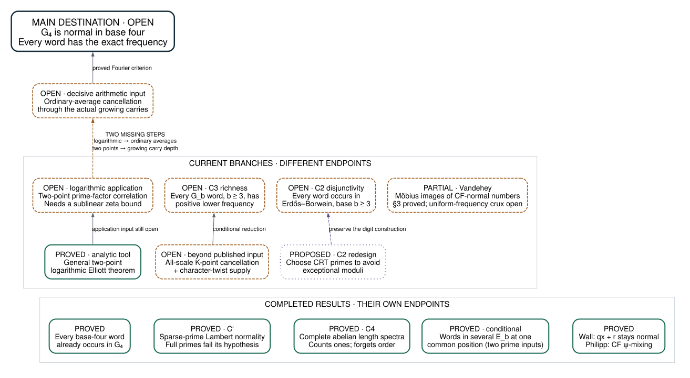

# Normal Numbers: where the proof stands

**Project map · 28 September 2026**  
[Headlines: the wide questions and ranked bets](HEADLINES.md) · [Visual edition](OVERVIEW.html) · [Detailed research review](docs/REVIEW-2026-09-25-research-trajectory.md)

## The destination

**Prove that an explicit, naturally arising number has genuinely random-looking digit frequencies.**  The central candidate here is the prime Lambert constant:

**G₄ = ∑ over primes p of 1/(4ᵖ − 1).**

We know that **every finite base-four word occurs** in G₄.  We do not know that each length-L word occurs with frequency exactly 4⁻ᴸ.  That second statement is normality, and remains the main open destination.

The programme has produced substantial complete results around this goal.  The remaining distance to G₄ normality includes new arithmetic, not just assembly of the results already proved.

## The map

**Reading the map:** solid arrows are proved reductions, with the labeled open inputs still required.  Dashed arrows are missing research steps.  Separate branches do not imply one another.  The completed sparse-prime theorem does not apply to the full prime set.

## What we have actually established

| Result | What it says | Its boundary |
|---|---|---|
| **G₄ is disjunctive** | Every finite base-four digit word appears. | Occurrence does not determine frequency. |
| **C′: a family of prime Lambert constants is normal** | Keep a prime set P with divergent reciprocal sum but vanishing reciprocal mass between √N and N.  Its Lambert constant is base-four normal. | All primes fail the vanishing-mass condition.  This is a finished theorem about a different family. |
| **Master conjectures: what Hypothesis A and Borel imply** | Bailey–Crandall Hypothesis A gives ln 2 normal in bases 2 and 3, π normal in bases 2 and 16 (BBP proved in-repo), and π² normal in base 2 given π² irrational; Borel gives √2 normal in every base.  One reusable machine turns any rational-kick series for an irrational into a normality theorem under Hypothesis A. | Conditional on the open conjectures themselves.  Hypothesis A for ln 2 is a restatement of its normality (now a kernel `↔`), and normality is blind to density-zero digit changes, so it cannot reach short-segment walls. |
| **Growing-prime localized logarithm is normal** | Restrict the binary series for ln 2 to indices whose prime factors are at most Y(m).  If π(Y(n)) ≤ (1−ε) log₂ log n, the result is normal in base 2, and Y may grow without bound, so every prime eventually appears. | Conditional on Vandehey's published Theorem 5.1 (a cited hypothesis).  The retained indices have density zero; no route to ln 2. |
| **Quantitative C′: residue-class prime Lambert constants are rich** | Bounded (not vanishing) √N-to-N reciprocal mass ρ gives discrepancy at most Cρ log³(1/ρ).  For primes in a class mod q, every fixed-length base-four word has positive lower frequency once q is large. | Positive lower frequency, not normality; small moduli and all primes (ρ = log 2) are out of range. |
| **C4: complete classification of abelian length spectra** | For binary digits, every set of positive lengths that is empty or contains 1 can be exactly the set of lengths with the correct binomial count of ones. | This statistic forgets digit order.  It does not establish normality of G₄. |
| **Simultaneous Lambert disjunctivity** | For finitely many distinct bases, including dependent ones such as 2 and 4, any prescribed words occur in the constants E_b = ∑ 1/(bⁿ − 1) at one common digit position, infinitely often, with at least N^(1−ε) occurrences below N. | Unconditional (29 September; merged 2 October).  With the single base 2 it answers Campbell's question (arXiv:2605.24160 §4): every binary string occurs infinitely often in binary E (`campbellEQuestion_holds`).  This is about occurrence, not frequency. |
| **Wall: rational maps preserve normality** | If x is normal in base b, so is qx + r for every rational q ≠ 0 and every rational r. | A classical theorem, now machine-checked. |
| **Philipp: continued-fraction ψ-mixing** | Gauss-measure cylinder sets mix at a geometric rate. | A classical input, proved rather than assumed. |
| **General two-point logarithmic Elliott** | A general theorem controlling logarithmically averaged two-point correlations of multiplicative functions is proved. | Applying it to the relevant prime-factor function still needs an estimate; its averages are logarithmic. |

Earlier completed work includes an explicit constructed number that is simultaneously absolutely normal, continued-fraction normal, and Khinchin typical.  The move toward naturally specified arithmetic constants introduced the new difficulties shown here.

## Where we are pressing

### Main frontier: the actual carries of G₄

Writing G₄ as **∑ ω(n)/4ⁿ**, where ω(n) counts distinct prime factors, exposes the difficulty: the coefficient at one position can carry into earlier digits.  Normality requires cancellation for the **actual growing carry window**, averaged over ordinary initial intervals.

Fixed-size prime-factor statistics, Poisson models, and even consistent distributions under shifts are insufficient.  Counterexamples to those generic routes are already recorded.  A successful input must use more of the specific arithmetic of ω.  The sufficient Fourier criterion is proved; the needed arithmetic cancellation is open.

### Elliott: a concrete analytic input, followed by a genuine strength gap

The latest work reduces the logarithmic two-point application to a **sublinear power-of-log bound for the logarithmic derivative of the Riemann zeta function**, in the specified height range.  The existing bound has exponent 9; the consumer needs an exponent below 1.

Closing that input would deliver the logarithmic application.  It would not automatically give ordinary averages, nor control arbitrarily growing carry depth.  Those gaps are drawn explicitly in the map.

### C3: every word with positive lower frequency

This is a meaningful intermediate target, called **richness**, for every prime Lambert constant G_b with b ≥ 3.  The September 25 audit found incorrect or vacuous inputs; their statements have since been repaired, and the branch is merged into the main tree.  Its central missing ingredient is now faithfully stated: **K-point cancellation at every sufficiently large scale**, without exceptional scales and with quantitative control as K grows, together with the required uniform analytic estimates.

The published two-point result with exceptional scales does not supply that input.  The `UniformResonantMass` proposition itself is already proved; an unfinished alternate proof is not a new mathematical barrier.

### Erdős–Borwein: simultaneous words across distinct bases

Scalar binary disjunctivity already has a [peer paper and conditional Lean development](https://github.com/CaptainSude/erdos-borwein-disjunctivity/tree/bd98789a177470cc4b3e33e6769e859f6144c906).  Our simultaneous version is now **formalized**: `jointLambertDisjunctivity` proves that prescribed words occur in finitely many constants **E_b** at a **common digit position**, infinitely often, even for bases 2 and 4.  The [paper proof](papers/2026-09-26-joint-lambert-disjunctivity.md) is the blueprint.  Both analytic inputs are now gone: interval supply follows from the ordinary prime number theorem, and rescaling the prime-search endpoint bypasses AGP, so the theorem is **unconditional**, together with an all-N occurrence count of N·exp(−C(log log N)² log log log N) (29 September, branch `proof/joint-lambert-unconditional`, not yet merged here).  AGP remains a separate analytic question (`docs/JOINT-LAMBERT-AGP-GAP.md`).  Our scalar C2 implementation remains incomplete.

### Continued fractions: Vandehey's open problem

Vandehey (2017) asks whether a Möbius image of a continued-fraction-normal number is again continued-fraction normal.  His own §3 relied on a Moshchevitin–Shkredov criterion that Airey and Mance refuted; the counterexample, using the digits 1, 2, 3, …, is now **proved in Lean**, so the gap in the published version of record is machine-checked rather than merely noted.  His **Theorem 1.1 is now proved here unconditionally, and by a different route that never uses §3 at all**: Serret's theorem plus Smith's reduction bring the general integer matrix down to multiplication by a prime, and there the explicit Raney L/R transducer supplies everything — a joint digit-window/projective-class equidistribution along every CF-normal x, converted to a digit frequency along the image by a monotone run clock.  So integer Möbius maps provably preserve CF normality.  What stays open is Vandehey's §7 Problem 1: **quadratic-irrational** maps such as x ↦ φx and x ↦ x + φ, where the transducer's state set lives over ℤ[φ] and Dirichlet's unit theorem destroys the finiteness the whole argument rested on.  That is the current target.

## What would count as a change in position?

| Next result | What changes |
|---|---|
| Expose C′ and C4 as readable standalone proofs | Makes two completed mathematical achievements independently assessable. |
| Supply Elliott's sublinear analytic bound | Completes a concrete logarithmic application. |
| Prove the faithful C3 inputs | Every word gains positive lower frequency, still short of normality. |
| Discharge the remaining joint Lambert prime input | Makes common-position words in distinct constants unconditional. |
| Break the ℤ[φ] finiteness wall in Vandehey's §7 Problem 1 | Quadratic-irrational images, such as φx and x + φ, of CF-normal numbers. |
| Prove ordinary cancellation through G₄'s growing carries | Reaches G₄ normality via the existing criterion. |

The growing-prime localized-logarithm proposal is another independent normality prospect, still at paper-audit stage.  It is not a route already connecting these branches to G₄.

## Evidence and upkeep

Snapshot: one checkout, `wip/g5-prime-subset`, with every campaign branch merged on 27–28 September and `lake build` covering every module.  Current fronts and the work queue: [STATUS.md](STATUS.md), [PENDING_WORK.md](PENDING_WORK.md).

Sources: [C′ audit statement](src/NormalNumbers/PrimeModelGradedStatement.lean), [carry criterion](src/NormalNumbers/G4WindowK.lean), [precise rungs](src/NormalNumbers/CastingOut.lean), [C4 theorem](src/NormalNumbers/AbelianWindowBuild.lean), [joint Lambert](src/NormalNumbers/JointLambertDisjunctivity.lean), [Elliott ledger](src/NormalNumbers/ElliottLedger.lean), [C3 headline](src/NormalNumbers/C3MrtBlockDefect.lean), [Vandehey Thm 1.1](src/NormalNumbers/VandeheyCapstone.lean), [C2 construction](src/NormalNumbers/SwingC2.lean), and [retired routes](src/NormalNumbers/Maze.lean).  The September 25 review predates C3's repair and the latest Elliott reduction.

This is the maintained reader's map.  Update it when a frontier is proved, refuted, or replaced; keep proof details in their existing source and research notes.  Diagram source: [docs/overview.dot](docs/overview.dot).  Rebuild the visual edition with `make -f docs/overview.mk`.
